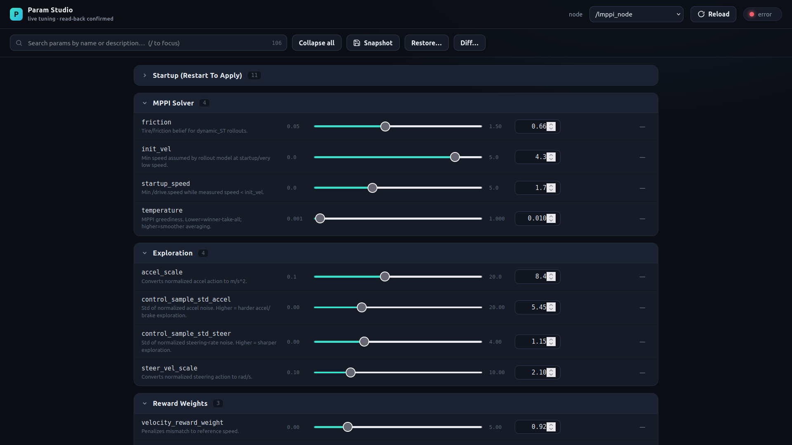

# param_studio

A modern, **offline** replacement for `rqt_reconfigure`, built for tuning the
MPPI controller live at ICRA over a possibly-bad network.

The whole reason it exists: stock `rqt_reconfigure` gives you **no confirmation
that a `set` actually landed**. On a flaky link you drag a slider and never know
if the value reached the node. Param Studio **reads every value back after
writing it** and shows a clear per-parameter verdict — confirmed, clamped,
rejected, or no-response — with the round-trip time.



## Features

- **Any node, auto-generated UI.** Reads each node's parameter *descriptors*, so
  float/int params with a declared range get sliders (correct bounds + decimals),
  bools get toggles, strings get text fields, and `read_only` params are locked.
- **Search.** Filter ~100+ params by name or description as you type (`/` to focus).
- **Set with read-back confirmation** — the headline feature:
  - **✓ confirmed** (green) — set succeeded *and* read-back matches, with RTT.
  - **stored** (amber) — set succeeded but `live_tuning_enabled` is off, so the
    controller hasn't picked it up yet (a banner reminds you).
  - **differs** (amber) — set succeeded but the node clamped/coerced the value.
  - **rejected** (red) — out of range or read-only; shows the node's reason.
  - **no response** (red) — timed out; value may not be set, retry.
  - Slider drags are debounced + de-duplicated so a bad link gets one clean write.
- **Connection health badge** with live RTT, so you can read the network at a glance.
- **Snapshot / Restore** params to/from timestamped YAML profiles (`ros2 param
  dump` layout). Snapshots are written next to your real `params_*.yaml` race
  configs (the MPPI config folder) so you can **restore from / diff against an
  actual race config**, not just tool-made snapshots. Grab a known-good config
  before a run; one click to restore after a crash — every restored value is
  confirmed by read-back. A **Browse…** button opens any YAML from anywhere on disk.
- **Diff vs profile** — see exactly which live params drift from a saved profile
  (or a race config), with per-row "revert to saved".
- **Group by prefix**, collapsible (open/closed state remembered).
- **Fully offline & self-contained.** No CDN, no internet, no extra ROS packages.
  Deps: `flask`, `pyyaml`, and `rclpy` (from ROS). Zip the folder, extract on the
  car, build, run.

## Build

```bash
cd ~/ros2_ws/roboracer_ws
colcon build --packages-select param_studio
source install/setup.bash
```

If `flask` isn't already available in your environment: `pip install flask pyyaml`.

## Run

```bash
ros2 run param_studio studio
```

Opens a dedicated **Firefox** window at `http://localhost:5077` (falls back to the
default browser). Pick a node from the dropdown — `/mppi` floats to the top —
search, tune, and watch the confirmation chips.

### Notes

- It talks to the **built-in ROS 2 parameter services**, so it works with any
  rclpy/rclcpp node unchanged (MPPI, opponent predictor, etc.).
- Snapshots default to the MPPI config folder
  (`mppi/mppi_bringup/config`) so they live alongside the real `params_*.yaml`
  configs; override with `PARAM_STUDIO_SNAPSHOT_DIR`. Generated snapshots are
  named `snapshot_<node>_<timestamp>.yaml`; the curated configs are starred (★)
  in the Restore/Diff picker.
- Run headless (no browser auto-open) with `PARAM_STUDIO_NO_BROWSER=1` and open
  the URL yourself — handy when running on the car and viewing from a laptop on
  the same network (`http://<car-ip>:5077`).

## Why not an rqt plugin / embedded webview?

This machine has no offline QtWebEngine / GTK-WebKit, and a Qt-native rewrite
would mean restyling widgets rqt already has. A small Flask + vanilla-JS app in a
Firefox window gets a modern look, stays 100% local, and is trivial to extract —
matching the team's existing `raceline_studio` approach.
